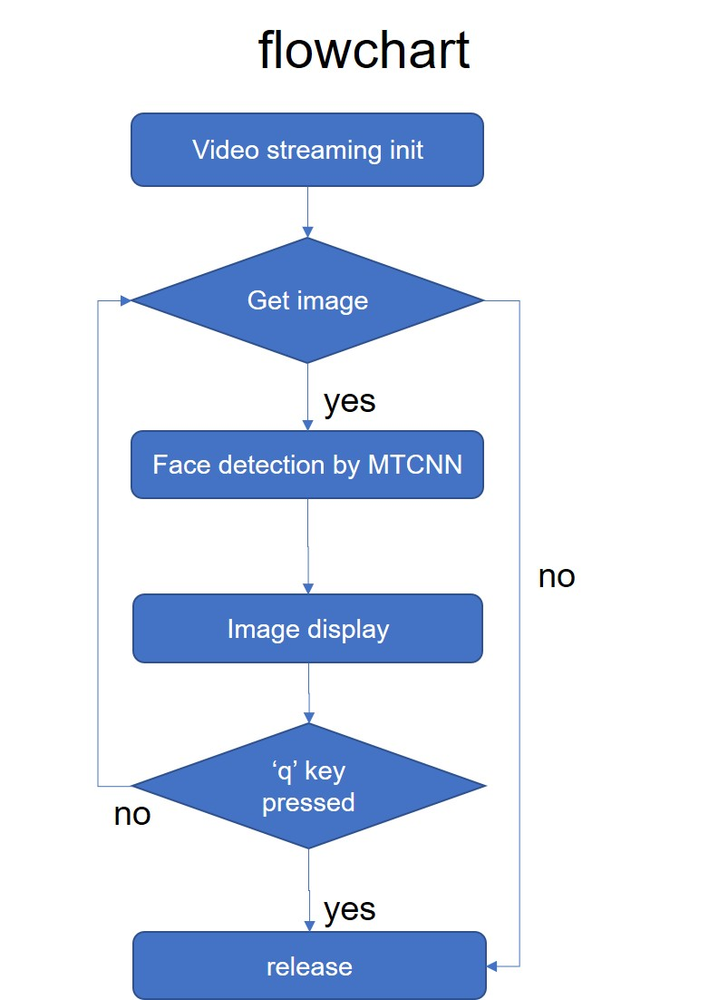

# MTCNN_tutorial

●MTCNN為Multi-task Cascaded Convolutional Networks的簡稱，用來執行人臉的偵測與對準，其演算法可參考[原文](https://arxiv.org/abs/1604.02878)

●原作者的程式碼可以參考[連結](https://github.com/kpzhang93/MTCNN_face_detection_alignment)

●本程式使用Python, openCV,及已經訓練好的MTCNN模型，連結USB照相機，進行即時人臉偵測的[教學](https://youtu.be/moSY8odDQKE)

●我的執行環境:Python 3.6.8, Tensorflow 1.13, openCV 3.3.1

●流程圖如下

★MTCNN is the abbreviation of Multi-task Cascaded Convolutional Networks. It performs face detection and alignment. The algorithm can be referred to the [link](https://arxiv.org/abs/1604.02878)

★The github link of MTCNN auther is [here](https://github.com/kpzhang93/MTCNN_face_detection_alignment)

★Python, openCV, pretrained MTCNN model, and a usb camera are used to execute real time face detection.

★My tutorial link is [here](https://youtu.be/moSY8odDQKE)

★My environment: Python 3.6.8, Tensorflow 1.13, openCV 3.3.1

★The flowchart is shown below

